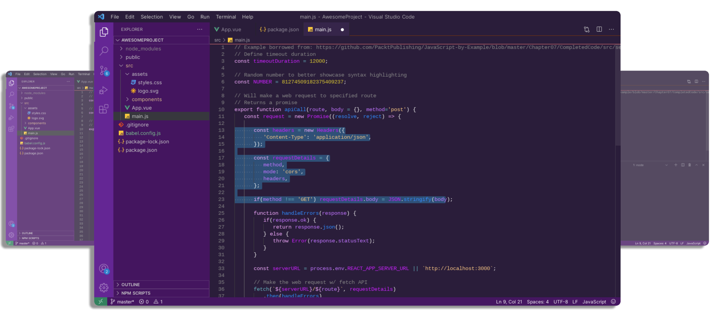
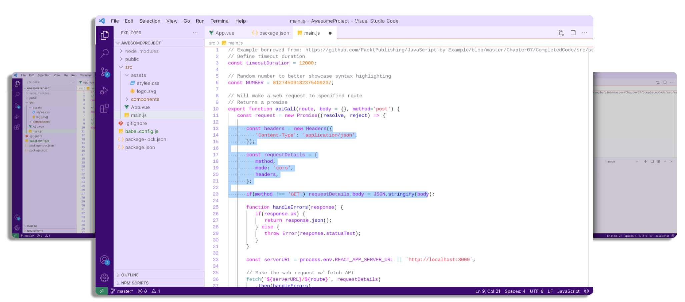

## Yes Girls Can Purple 
A feminine color theme made for girls who love to code, support tech girls, and want a color theme to match their liking for purple 😊💜🤩

To attract more girls to STEM, we need to show the beauty, colorfulness and diversity of this world. This is one of the options.
There are two theme options - dark and light. Choose what you like best and enjoy using it 🤗✨💡

Remember, a Software Engineer should not use a dark theme unless they are comfortable with it. There are no rules! There are only your choice and your comfort 🙌

### Theme Examples

Brought to you by [Anastasiia STEMINIST UA](https://www.instagram.com/steminist.ua/)
